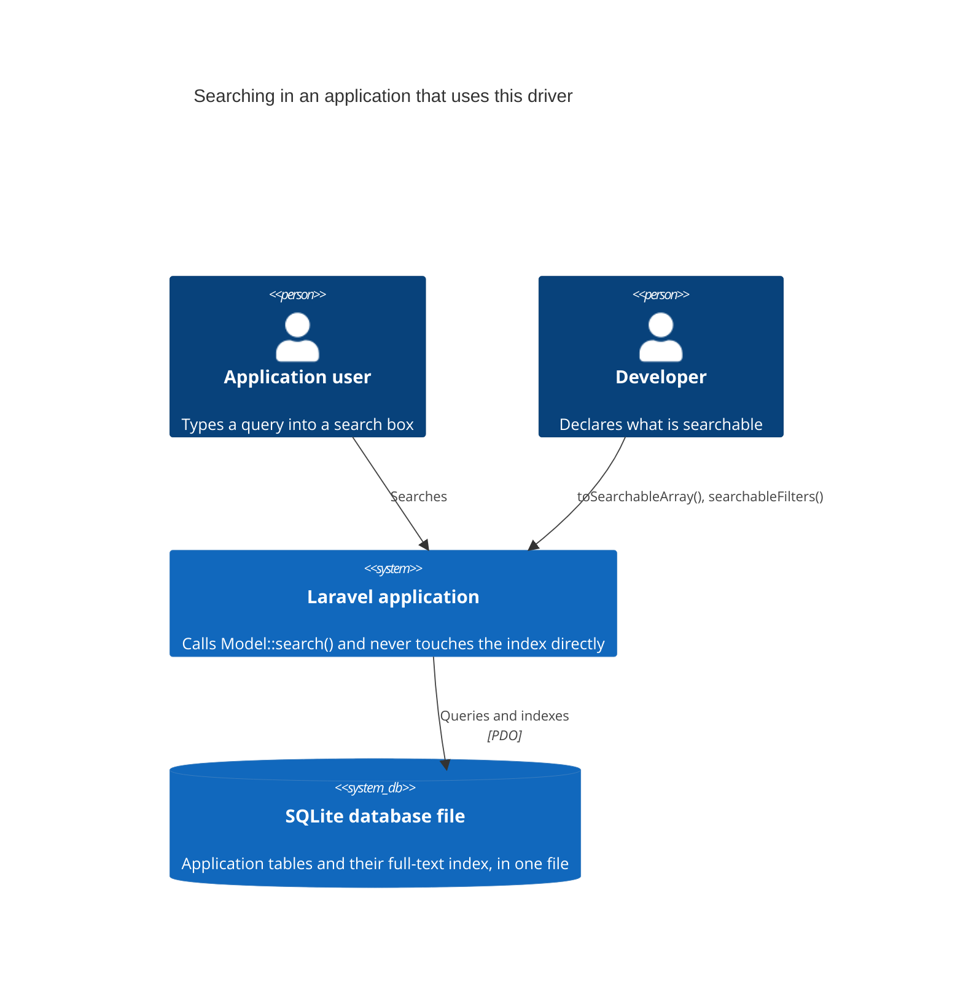
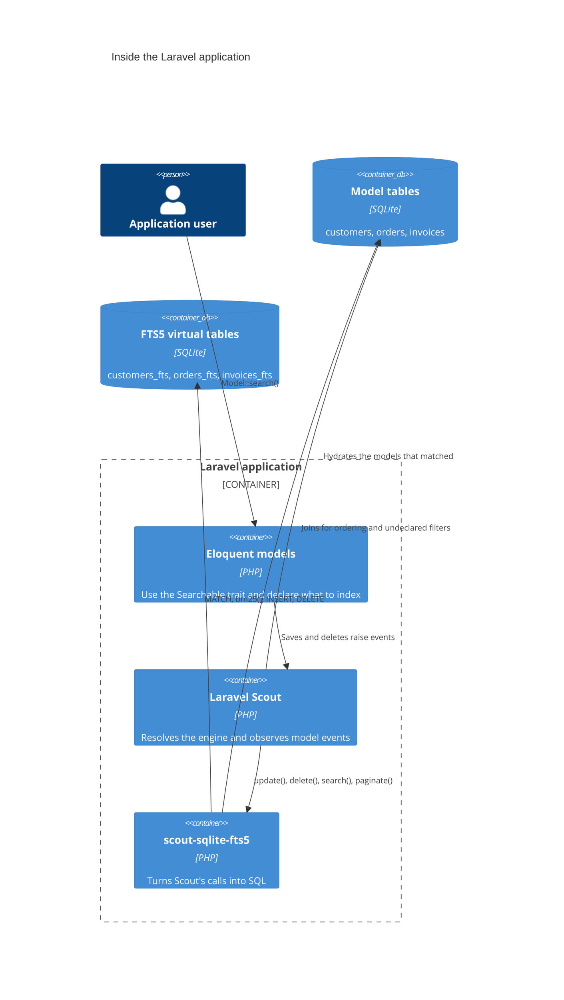
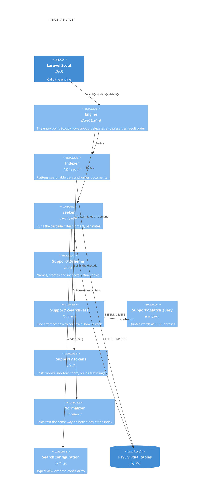
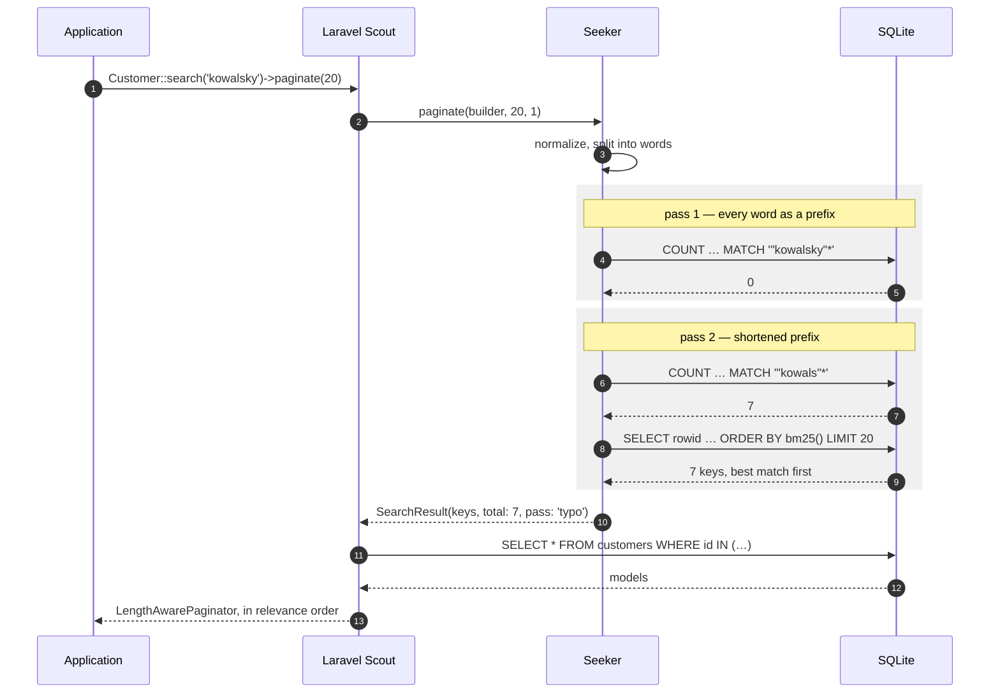

# Architecture

[← back to the README](https://github.com/mtk3d/scout-sqlite-fts5#readme)

The package is small, but it sits between three things that each have opinions — Eloquent, Scout and FTS5 — so it helps to see where the boundaries fall. The diagrams below follow the [C4 model](https://c4model.com/), zooming in one level at a time.

## Level 1 — System context

The point of the whole package is what is *missing* from this picture: there is no search service. With Meilisearch, Typesense or Algolia there would be a second system here, with its own process, network hop, credentials and failure modes. Here the index is a set of tables in the database file the application already opens.

## Level 2 — Containers

Two arrows in that diagram carry most of the design.

The first is `driver → tables`. The index is not a separate world: it lives in the same file as the data, which is why the driver can join the model's own table to answer a filter on a column that was never indexed, or to sort by one. An engine talking to a remote service cannot do that — it would have to either refuse the query or fetch everything and sort in PHP.

The second is `scout → tables`. The driver returns keys, not models. Hydration is Scout's job, and it applies whatever constraints the caller attached with `query()`.

## Level 3 — Components

The split that matters is `Indexer` and `Seeker`: the write path and the read path share nothing but the `Schema` that names their tables and the `Normalizer` that has to fold text identically on both sides. Everything under `Support` is free of framework imports and could be tested without booting an application.

## A search, end to end

Passes three and four never run: the cascade stops at the first one that matches. A query that finds an exact hit costs one `COUNT` and one `SELECT`; only a query that finds nothing pays for every interpretation, ending in the substring scan.

The count is a separate statement from the page. That is what lets the paginator report seven matches while returning at most twenty rows — and what keeps ordering and slicing in SQL rather than in PHP.
